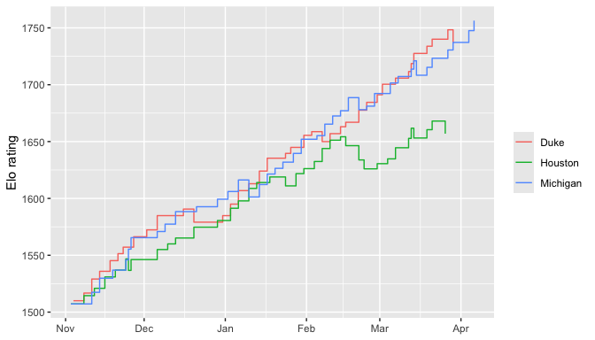

# elomakeR

Elo ratings for arbitrary head-to-head sports, built to interface with
the tidyverse. Column mapping uses tidy evaluation, so `calculate_elo()`
works directly with whatever schema your games data already has – no
renaming required.

## Installation

Not (yet) on CRAN. From GitHub:

``` r
# install.packages("devtools")
devtools::install_github("mattwaite/elomakeR")
```

## Example: 2025-26 NCAA D-I men’s basketball

The bundled `basketball_games` dataset (pulled with `hoopR`) has
separate home/away columns and a real `neutral_site` flag for tournament
games played at neither team’s venue:

``` r
library(elomakeR)
data(basketball_games)
head(basketball_games[, c("date", "home_location", "away_location", "home_score", "away_score", "neutral_site")])
#>         date home_location away_location home_score away_score neutral_site
#> 1 2025-11-03           TCU   New Orleans         74         78        FALSE
#> 2 2025-11-03      Ole Miss  SE Louisiana         88         58        FALSE
#> 3 2025-11-03      Bucknell      Delaware         78         70        FALSE
#> 4 2025-11-03         Miami  Jacksonville         86         69        FALSE
#> 5 2025-11-03  South Dakota     Utah Tech         79         81        FALSE
#> 6 2025-11-03       Belmont     Air Force         79         63        FALSE
```

`calculate_elo()` maps these columns directly, including the neutral
flag:

``` r
elo <- calculate_elo(
  basketball_games,
  date = date, team1 = home_location, team2 = away_location,
  score1 = home_score, score2 = away_score,
  home_team = home_location, neutral = neutral_site
)
elo
#> # A tibble: 12,600 × 13
#>    game_id date       season team       opponent is_home score_for score_against
#>    <chr>   <date>     <lgl>  <chr>      <chr>    <lgl>       <dbl>         <dbl>
#>  1 1       2025-11-03 NA     New Orlea… TCU      FALSE          78            74
#>  2 1       2025-11-03 NA     TCU        New Orl… TRUE           74            78
#>  3 10      2025-11-03 NA     Oklahoma   Saint F… TRUE          102            66
#>  4 10      2025-11-03 NA     Saint Fra… Oklahoma FALSE          66           102
#>  5 100     2025-11-03 NA     Nebraska   West Ge… TRUE           86            53
#>  6 100     2025-11-03 NA     West Geor… Nebraska FALSE          53            86
#>  7 101     2025-11-03 NA     Drake      Norther… FALSE          77            71
#>  8 101     2025-11-03 NA     Northern … Drake    FALSE          71            77
#>  9 102     2025-11-03 NA     La Sierra  UC Rive… FALSE          49            90
#> 10 102     2025-11-03 NA     UC Rivers… La Sier… TRUE           90            49
#> # ℹ 12,590 more rows
#> # ℹ 5 more variables: result <dbl>, win_prob <dbl>, pre_elo <dbl>,
#> #   post_elo <dbl>, elo_change <dbl>
```

The result is a long tibble – one row per team per game – which plugs
straight into dplyr/ggplot2 workflows. Current standings:

``` r
latest_ratings(elo)
#> # A tibble: 727 × 3
#>    team       rating date      
#>    <chr>       <dbl> <date>    
#>  1 Michigan    1756. 2026-04-06
#>  2 Arizona     1739. 2026-04-04
#>  3 Duke        1737. 2026-03-29
#>  4 UConn       1697. 2026-04-06
#>  5 Miami (OH)  1692. 2026-03-20
#>  6 Gonzaga     1680. 2026-03-21
#>  7 St. John's  1671. 2026-03-27
#>  8 Virginia    1667. 2026-03-22
#>  9 Akron       1663. 2026-03-20
#> 10 High Point  1663. 2026-03-21
#> # ℹ 717 more rows
```

Rating trajectories for a few teams:

``` r
library(ggplot2)
autoplot(elo, teams = c("Duke", "Michigan", "Houston"))
```



## Tuning the learning rate and home advantage

Rather than guessing `k` and `home_advantage`, search for the values
that best predict this season’s (or a prior season’s) results, scored by
log-loss:

``` r
suggest_learning_rate(
  basketball_games,
  date = date, team1 = home_location, team2 = away_location,
  score1 = home_score, score2 = away_score,
  home_team = home_location, neutral = neutral_site,
  k_grid = seq(10, 40, by = 5)
)
#> $best_k
#> [1] 40
#> 
#> $best_score
#> [1] 0.5813376
#> 
#> $metric
#> [1] "log_loss"
#> 
#> $grid
#> # A tibble: 7 × 2
#>       k score
#>   <dbl> <dbl>
#> 1    10 0.612
#> 2    15 0.603
#> 3    20 0.596
#> 4    25 0.591
#> 5    30 0.587
#> 6    35 0.584
#> 7    40 0.581
```

``` r
suggest_home_advantage(
  basketball_games,
  date = date, team1 = home_location, team2 = away_location,
  score1 = home_score, score2 = away_score,
  home_team = home_location, neutral = neutral_site,
  home_advantage_grid = seq(0, 150, by = 25)
)
#> $best_home_advantage
#> [1] 125
#> 
#> $best_score
#> [1] 0.5941979
#> 
#> $metric
#> [1] "log_loss"
#> 
#> $grid
#> # A tibble: 7 × 2
#>   home_advantage score
#>            <dbl> <dbl>
#> 1              0 0.646
#> 2             25 0.627
#> 3             50 0.613
#> 4             75 0.602
#> 5            100 0.596
#> 6            125 0.594
#> 7            150 0.596
```

`tune_elo()` searches both parameters jointly when they might interact.
If the best value in a grid search lands on the edge of the grid you
passed in, widen the grid and try again – that’s a sign the true optimum
is further out.

## Margin of victory

Set `mov_adjustment = "log"` to scale the rating change up for lopsided
wins and down for narrow ones (ties are left untouched):

``` r
calculate_elo(
  basketball_games,
  date = date, team1 = home_location, team2 = away_location,
  score1 = home_score, score2 = away_score,
  home_team = home_location, neutral = neutral_site, mov_adjustment = "log"
) |>
  latest_ratings()
#> # A tibble: 727 × 3
#>    team       rating date      
#>    <chr>       <dbl> <date>    
#>  1 Michigan    2018. 2026-04-06
#>  2 Duke        1975. 2026-03-29
#>  3 Arizona     1956. 2026-04-04
#>  4 UConn       1867. 2026-04-06
#>  5 Florida     1857. 2026-03-22
#>  6 St. John's  1856. 2026-03-27
#>  7 Illinois    1843. 2026-04-04
#>  8 Gonzaga     1839. 2026-03-21
#>  9 Purdue      1833. 2026-03-28
#> 10 Virginia    1823. 2026-03-22
#> # ℹ 717 more rows
```

## Multi-season carryover

For data spanning multiple seasons, map a `season` column and choose how
ratings carry over at each season boundary: `"continuous"` (default),
`"reset"` (back to `initial_rating`), or `"regress"` (move a fraction of
the way back to `initial_rating`, via `regress_pct`).

## A messier schema: 2025 NCAA D-I women’s volleyball

`calculate_elo()` doesn’t care how odd the input schema is. The bundled
`volleyball_sets` dataset uses arbitrary `team1`/`team2` labels rather
than home/away columns, points to the home team with a separate
`home_team` column (`team2`, here), and records the outcome as sets won
(`team1_sets_won`/`team2_sets_won`, best of 5) rather than a single
score:

``` r
data(volleyball_sets)
calculate_elo(
  volleyball_sets,
  date = date, team1 = team1, team2 = team2,
  score1 = team1_sets_won, score2 = team2_sets_won,
  home_team = team2
) |>
  latest_ratings()
#> # A tibble: 356 × 3
#>    team        rating date      
#>    <chr>        <dbl> <date>    
#>  1 Nebraska     1729. 2025-12-14
#>  2 Texas A&M    1723. 2025-12-21
#>  3 Kentucky     1699. 2025-12-21
#>  4 Wisconsin    1694. 2025-12-18
#>  5 Arizona St.  1684. 2025-12-11
#>  6 Pittsburgh   1680. 2025-12-18
#>  7 Creighton    1672. 2025-12-13
#>  8 Stanford     1672. 2025-12-12
#>  9 Texas        1667. 2025-12-14
#> 10 Purdue       1657. 2025-12-13
#> # ℹ 346 more rows
```

## Data prep `calculate_elo()` won’t do for you

`calculate_elo()` will happily rename columns for you, but it assumes
your data is already **one row per game**, with a single value each for
`team1`, `team2`, `score1`, and `score2` on that row. Column mapping
flexibility doesn’t help if the rows themselves aren’t shaped that way
yet – and a lot of real schedule data isn’t, because it’s built to
answer “what did this team’s season look like” rather than “what
happened in this game.”

A concrete case: an NCAA baseball schedule scrape (one row per team per
game, not one row per game) that looks roughly like this:

    team_name  opponent_name  team_score  opponent_score  game_type  result  contest_id
    UCLA       UC San Diego   8           4               Home       W       6534937
    UC Irvine  Sacramento St. 5           0               Home       W       6519201

Three mismatches with what `calculate_elo()` expects, and none of them
are things it should silently guess at – getting them wrong doesn’t
raise an error, it just produces wrong ratings:

- **Every game is listed twice** – once from each team’s perspective,
  same `contest_id`, scores mirrored. Feed both rows in and that game’s
  rating update gets applied twice.
- **Home/away is per row, not per game.** A `game_type` column of
  `"Home"`/`"Away"`/`"Neutral"` describes *that row’s* team, not a fixed
  home team for the game – there’s no single column you can point
  `home_team` at until you derive one.
- **Some rows have no result yet** (canceled, postponed, rained out) and
  no score to give `score1`/`score2`.

Clean all three with ordinary dplyr before calling `calculate_elo()`:

``` r
library(dplyr)

games <- raw_schedule |>
  # drop games with no final score
  filter(result %in% c("W", "L", "T")) |>
  # collapse the two mirrored rows into one row per real game
  distinct(contest_id, .keep_all = TRUE) |>
  # turn the per-row home/away/neutral indicator into one home_team column
  mutate(
    home_team = case_when(
      game_type == "Home" ~ team_name,
      game_type == "Away" ~ opponent_name,
      TRUE ~ NA_character_
    ),
    neutral = game_type == "Neutral"
  )

calculate_elo(
  games,
  date = game_date, team1 = team_name, team2 = opponent_name,
  score1 = team_score, score2 = opponent_score,
  home_team = home_team, neutral = neutral, game_id = contest_id
)
```

A cheap sanity check that you deduplicated correctly: the output of
`calculate_elo()` always has exactly twice as many rows as its input
(one row per team per game), so `nrow(games) * 2` should equal
`nrow(elo)`. If a team’s rating swings by an implausible amount after
one game, mirrored duplicate rows are the first thing to check for.
